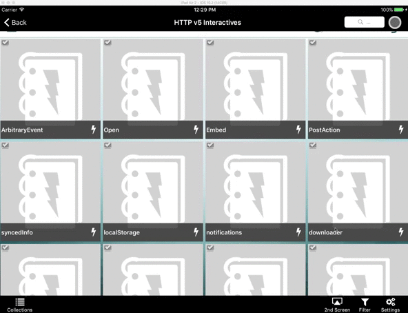
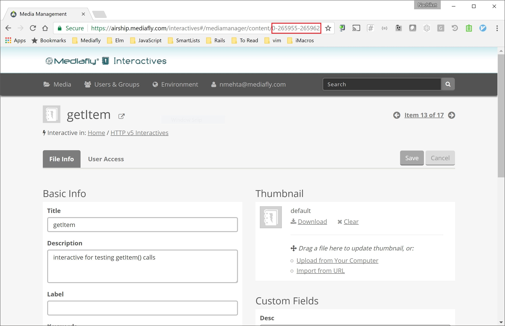

# Mediafly Interactives [](https://travis-ci.org/mediafly/mfly-interactive)

## Install

### Option 1: Global install (if you are not using build tools such as gulp)

Enter the following in the terminal

```
$ npm install -g mfly-interactive
```

Run in the folder where the Interactive is located.

```
$ mfly-interactive serve
```

### Option 2: Local install (if you have gulp, grunt, etc. with a static file server)

This package can also be used as a node.js middleware. You can plug in this middleware in the static file server responsible for serving up your Interactive.


Enter the following in the terminal

```
$ npm install mfly-interactive --save-dev
```

Here is an example of how to set up a [BrowserSync](http://www.browsersync.io/) server. The same can be done with any connect server as well. Here, the middleware provided by `mfly-interactive` can be supplied to your server.


```
var browserSync = require("browser-sync")
var options = require('./mfly-interactive.config.json')
//Viewer slug is required here
options.slug = '{VIEWER_SLUG}'
var viewerMiddleware = require('mfly-interactive')(options)
	
browserSync({
	files: 'app/**',
	https: true,
	server: {
		baseDir: './app',
		middleware: [
			viewerMiddleware
		]
	}
})
```

## Initialize

1. Upload the Interactive into Airship
2. Run `mfly-interactive init`. See [Explanation for required parameters](#explanation-for-required-parameters) for details on how to find information requested by this command.

Note: The `init` command creates `mfly-interactive.config.json` at the root of your Interactive. `mfly-interactive.config.json` contains Airship user specific information. Be sure to add it to your `.gitignore` file.

**Please note that local changes to the Interactive will not update the uploaded Interactive. When finished making changes, you will need to upload the Interactive in Airship again.**

## Testing Interactives on iOS (Availability: iOS (662))

mfly-interactive can speed up testing of Interactives on iOS. Specifically it provides the following 2 features:

1. Interactives will live reload in the iOS app upon file save.
2. JavaScript `console` messages from the iOS WebView will be shown in the terminal.

Steps to set this up:

1. Ensure `mfly-interactive serve` command is running.
2. Open the iOS app and tap the "Settings" icon on the bottom toolbar and tap "About".
3. Tap the title bar of the About modal dialog rapidly (more than 10 times). At this point you will see the "DEVELOPER!" modal window.
4. Enter the IP address and port from the "External" URL that is shown in your terminal that is running mfly-interactive. Now the app is configured to use the mfly-interactive proxy. The main title bar of the app will display the IP address and port.
5. Navigate to the specific Interactive you are working on. Long tap the item.
6. Select "Add to proxy" from the context menu.
7. Open the Interactive.

Now you are set to test the Interactive on iOS. Open the "DEVELOPER!" modal by following steps 1-3 to turn off the proxy.



## Packaging an Interactive

While the `publish` command will package and upload the Interactive, `mfly-interactive` can only package the Interactive as well by running:

```
$ mfly-interactive release
```


## Publishing an Interactive

Once you are ready to test the Interactive on other platforms, or if you are ready to publish it for your users, you can publish it by using the following command.

```
$ mfly-interactive publish
```

## Explanation for Required Parameters

- Airship User ID and Password: Credentials used to log into [https://airship.mediafly.com](airship.mediafly.com)
- Airship Item Id: This is the Id for the Interactive in Airship. You can locate it by navigating to the item in Airship and extractig it from the URL. In the following example, the Airship item Id is 0-265955-265962. 
- Company Code: Company code used in Viewer.

## Reconfiguring

It is possible that the Airship Item Id or the Viewer slug of the your Interactive changes. In this case, you will need to reconfigure the Interactive. You can do this by runninig `mfly-interactive init` again.

## A note on HTTPS
Your browser will show a warning about HTTPs. Ignore this warning.
